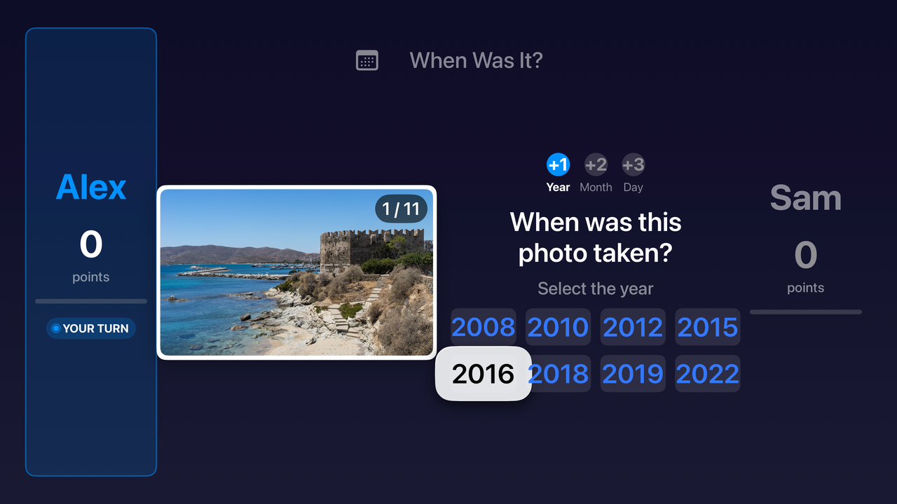
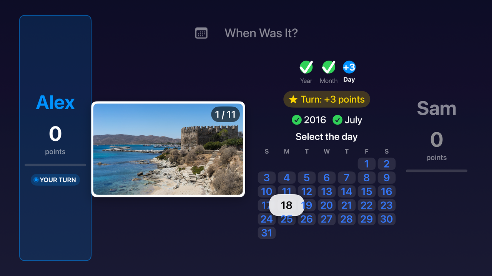
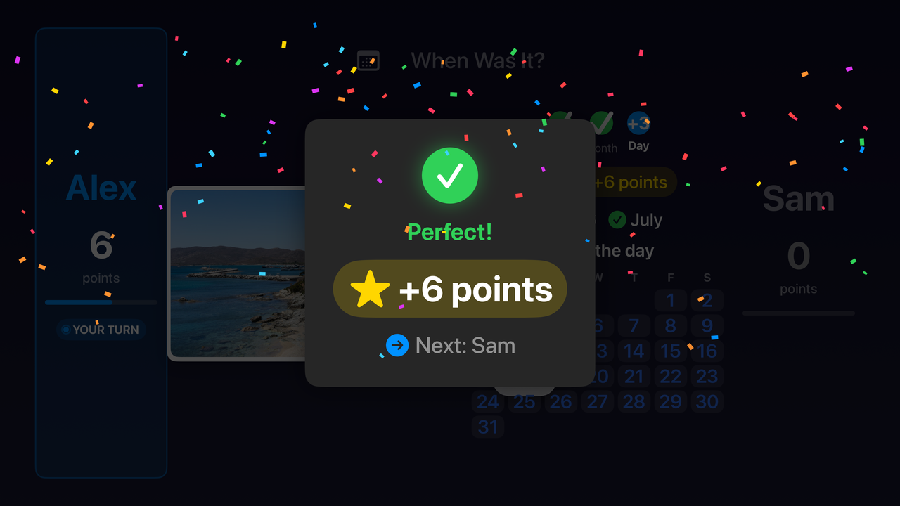
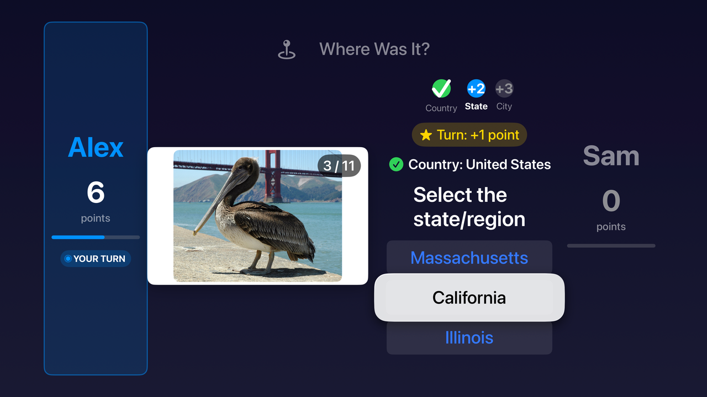
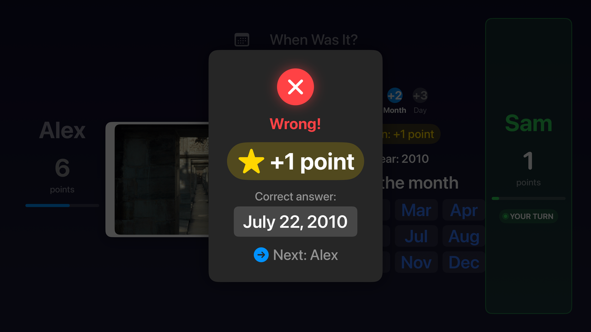
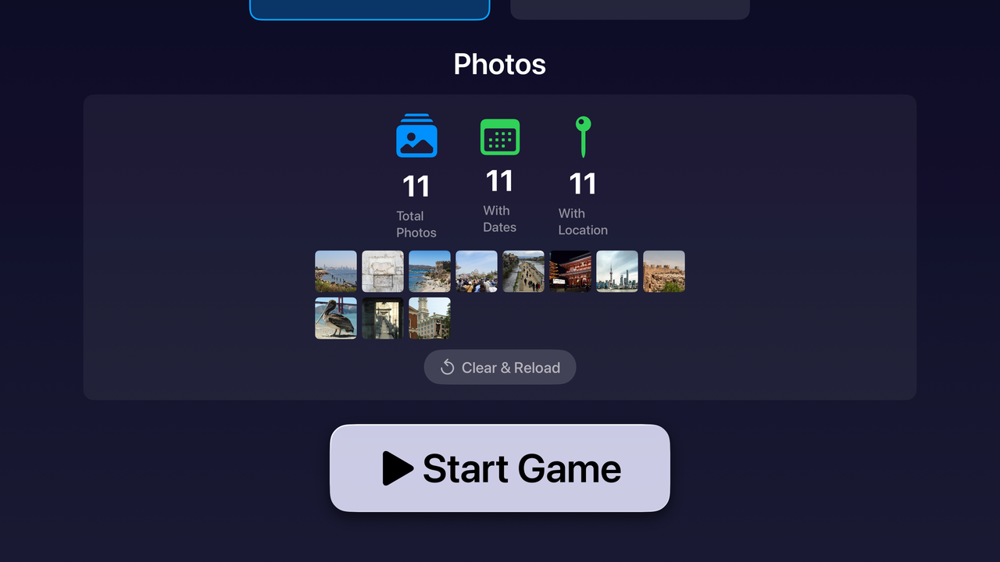

# Photo Guessing Game (tvOS)

<!-- BADGES:START -->


[](LICENSE.md)
[](CONTRIBUTING.md)
<!-- BADGES:END -->

## Table of Contents

- [Description](#description)
- [Screenshots](#screenshots)
- [Features](#features)
- [Requirements](#requirements)
- [Installation](#installation)
- [Usage](#usage)
  - [Setting up a game](#setting-up-a-game)
  - [Taking a turn](#taking-a-turn)
  - [Scoring and winning](#scoring-and-winning)
- [Architecture](#architecture)
- [Credits](#credits)
- [Contributing](#contributing)
- [License](#license)

## Description

A two-player party game for the living room. The Apple TV shows a photo from
your own library and the players take turns guessing **when** it was taken (year,
then month, then day) or **where** (country, then state, then city). Each correct
answer is worth more than the last, a wrong answer ends the turn, and the first
player to 10 points wins.

It is a native tvOS app written in SwiftUI and played entirely with the Siri
Remote.

## Screenshots

<p align="center">
  
</p>

<p align="center"><em>A <strong>When Was It?</strong> turn: the first rung asks for the year.</em></p>

<p align="center">
  
  
</p>

<p align="center"><em>The day rung, from a calendar of the right month, and a perfect turn.</em></p>

<p align="center">
  
  
</p>

<p align="center"><em>A <strong>Where Was It?</strong> turn at the state rung, and a wrong answer, which shows the right one and keeps the points already won.</em></p>

<p align="center">
  
  
</p>

<p align="center"><em>Setup with a photo library loaded, and the end of a match.</em></p>

These are real captures from the tvOS 26.5 Simulator (Apple TV 4K), driven with
the Siri Remote by an Xcode UI test. The photos are public-domain (CC0) pictures
from Wikimedia Commons, credited under [Credits](#credits).

## Features

- **Two game modes.** *When Was It?* asks for the year, month and day; *Where
  Was It?* asks for the country, state or region, and city.
- **A three-rung scoring ladder** worth 1, 2 and 3 points, so a perfect turn
  scores 6 and gets a confetti celebration.
- **Your own photos.** Pictures come from the photo library through PhotoKit:
  dates from each photo's metadata, places from its GPS position.
- **Place names from OpenStreetMap.** GPS positions are reverse-geocoded through
  the Nominatim API, throttled to its one-request-per-second limit.
- **A fair finish.** If Player 1 reaches 10 first, Player 2 gets one more turn
  to catch up.
- **A demo mode** that generates photos with random dates and places, so the
  game can be tried without a photo library.
- **Synthesised sound effects.** The clicks, arpeggios and fanfare are generated
  with AVFoundation at runtime, so the app ships no audio files.
- **Built for the remote.** Every control is reachable by focus navigation, with
  large targets and scale animations on the focused element.

## Requirements

- A Mac with **Xcode 15** or newer (the project uses the Swift 5 language mode
  and builds with the Swift 5.9+ toolchain)
- The **tvOS 17.0** Simulator, or an Apple TV running tvOS 17.0 or newer
- To run on a real Apple TV: an Apple developer account to sign the app with.
  The project ships with no development team selected.
- For real photos: photos available to the Apple TV's Photos app, and
  permission for the game to read them (it asks on first use)
- For *Where Was It?*: network access to `nominatim.openstreetmap.org`, and
  photos that carry a GPS position

## Installation

```bash
git clone https://github.com/geoffmyers/photo-guessing-game-tvos.git
cd photo-guessing-game-tvos
open PhotoGuessingGame.xcodeproj
```

Then, in Xcode:

1. Select the **PhotoGuessingGame** target and, under *Signing & Capabilities*,
   choose your own team. This is only needed for a physical Apple TV.
2. Pick an Apple TV simulator or your paired Apple TV as the run destination.
3. Build and run with **⌘R**.

## Usage

### Setting up a game

1. Enter a name for each player.
2. Choose **When Was It?** or **Where Was It?**.
3. Load photos from the library, or choose **Use Demo Photos** to play without
   one.
4. Start the game.

### Taking a turn

The current player sees a photo and answers one rung at a time. Swipe on the
Siri Remote to move between choices and click to select.

| Mode | Rung 1 | Rung 2 | Rung 3 |
|---|---|---|---|
| When Was It? | Year, from 8 choices | Month | Day, from a calendar grid |
| Where Was It? | Country, from up to 5 | State or region, from up to 5 | City, from up to 5 |

The place choices come from the loaded photos: the countries they were taken
in, then the states among the photos from the answer's country, then the cities
among those from its state. A small library can therefore offer a single state
or city. If reverse geocoding found no state or no city for a photo, that rung
is skipped.

A correct answer banks its points and moves to the next rung. A wrong answer
shows the right one and ends the turn, but **the points already banked are
kept**. After the feedback screen, play passes to the other player with a new
photo.

### Scoring and winning

| Rung | Points | Running total |
|---|---|---|
| 1 (year or country) | 1 | 1 |
| 2 (month or state) | 2 | 3 |
| 3 (day or city) | 3 | 6 |

The first player to reach **10 points** wins. If Player 1 gets there first,
Player 2 gets a turn to catch up:

- if Player 2 reaches 10 as well, the higher score wins (a tie plays on);
- if Player 2 stays below 10, play continues, and Player 1 wins at the end of
  their next turn.

If the photos run out, the higher score wins; a tie with no photos left ends on
a "no photos" screen.

## Architecture

A single SwiftUI app target, organised by role:

| Path | What lives there |
|---|---|
| `PhotoGuessingGame/PhotoGuessingGameApp.swift` | App entry point |
| `PhotoGuessingGame/ContentView.swift` | Routes between the setup, game, victory and no-photos screens by game phase |
| `PhotoGuessingGame/Models/GameModels.swift` | Players, photos, game phases, guess rungs and their points, `winningScore` |
| `PhotoGuessingGame/ViewModels/GameViewModel.swift` | Game state: turns, scoring, feedback and the tie-breaker |
| `PhotoGuessingGame/Views/` | SwiftUI screens: setup, photo loader, game board, one selector per rung, feedback, victory, confetti, and focusable buttons |
| `PhotoGuessingGame/Services/` | `PhotoService` (PhotoKit and the demo set), `LocationService` (Nominatim), `SoundService` (synthesised audio) |
| `PhotoGuessingGame/Utils/GameUtils.swift` | Builds the answer choices |

See [ARCHITECTURE.md](ARCHITECTURE.md) for the constraints specific to a
remote-driven, ten-foot interface.

## Credits

- Built with [SwiftUI](https://developer.apple.com/xcode/swiftui/),
  [PhotoKit](https://developer.apple.com/documentation/photokit) and
  [AVFoundation](https://developer.apple.com/av-foundation/).
- Place names come from [OpenStreetMap](https://www.openstreetmap.org/copyright)
  through the [Nominatim](https://nominatim.org/) reverse-geocoding service.
  OpenStreetMap data is © OpenStreetMap contributors and available under the
  Open Database License (ODbL).
- The photos in the screenshots are from Wikimedia Commons, released into the
  public domain (CC0) by
  [DimiTalen](https://commons.wikimedia.org/wiki/User:DimiTalen),
  [Ermell](https://commons.wikimedia.org/wiki/User:Ermell),
  [Bernard Gagnon](https://commons.wikimedia.org/wiki/User:Bgag) and
  [Jebulon](https://commons.wikimedia.org/wiki/User:Jebulon).
- Apple TV, tvOS, SwiftUI and Xcode are trademarks of Apple Inc. This project is
  not affiliated with or endorsed by Apple.

Written by Geoff Myers.

## Contributing

Bug reports and pull requests are welcome. See [CONTRIBUTING.md](CONTRIBUTING.md)
for setup, checks and how this repository is published.

## License

This program is free software: you can redistribute it and/or modify it under
the terms of the GNU General Public License as published by the Free Software
Foundation, either version 3 of the License, or (at your option) any later
version.

This program is distributed in the hope that it will be useful, but WITHOUT ANY
WARRANTY; without even the implied warranty of MERCHANTABILITY or FITNESS FOR A
PARTICULAR PURPOSE. See [LICENSE.md](LICENSE.md) for the full text of the GNU
General Public License.

SPDX-License-Identifier: `GPL-3.0-or-later`
